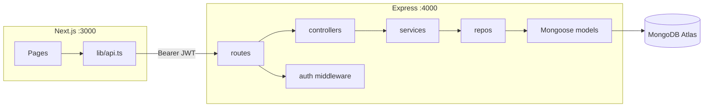

# CollabBoard

Full-stack collaborative workspace: Dashboard, Work Tree, Kanban Board, Task Detail, and Gantt. The **Next.js** frontend (`:3000`) talks to an **Express** REST API (`:4000`) backed by **MongoDB Atlas** via Mongoose. Public string ids (`u-ada`, `ws-website`, …) are preserved for demos.

## Architecture



The backend is layered **routes → controllers → services → repos → Mongoose → Atlas**. CORS allows `http://localhost:3000`. Auth uses **Bearer JWT** (stored in `localStorage` on the client) so Postman and the frontend share the same scheme.

### Embed vs reference

| Thing | Decision | Why |
|---|---|---|
| Kanban columns | **Not a collection.** Frozen enum `todo \| in_progress \| review \| done` | Bounded, never grow |
| Workspace members + **role** + visibility | **Embedded array** on Workspace | Tens of members; always loaded with workspace |
| Tree nodes | **Own collection** | Nested; queried as a tree; developers see a subset |
| Tasks | **Own collection** | Unbounded; edited/dragged constantly |
| Task comments (`Message`) | **Own collection** | Grow without bound |
| Workspace chat | **Own collection** | High write rate; independent of tasks |
| Users | **Own collection** | Shared across workspaces; unique email |
| Presence | **Not stored** (Socket.io memory) | Ephemeral |
| Activity / audit | **Own collection** | “Ada moved task-12 to review” |

## Setup

Run the API and frontend in separate terminals.

**Backend** (`http://localhost:4000`):

```bash
cd backend
cp .env.example .env   # then set real MONGODB_URI (Atlas, DB name collabboard)
npm install
npm run seed           # upsert demo data into Atlas (idempotent)
npm run dev
```

Required `.env` in `backend/` (never commit secrets):

| Variable | Default / notes |
|---|---|
| `PORT` | `4000` |
| `JWT_SECRET` | `replace-me-in-real-env` |
| `CLIENT_ORIGIN` | `http://localhost:3000` |
| `MONGODB_URI` | Atlas URI with `/collabboard?retryWrites=true&w=majority` |

Data survives API restarts. Re-run `npm run seed` anytime to refresh demo ids (`u-ada`, `ws-website`, …).

**Frontend** (`http://localhost:3000`):

```bash
cd frontend
npm install
npm run dev
```

Optional: set `NEXT_PUBLIC_API_URL` in `frontend/.env.local` if the API is not on `http://localhost:4000`.

Open [http://localhost:3000](http://localhost:3000). `/` redirects to `/dashboard`. Sign in at `/login`.

**Demo login:** `ada@collabboard.local` / `CollabBoard!1`

```bash
cd frontend && npm run build
cd backend && npm test
```

## Stack

| Layer | Tech |
|---|---|
| Frontend | Next.js 16 (App Router), TypeScript, Tailwind CSS, `lucide-react` — import alias `@/*` |
| Backend | Node.js 20+, Express, JWT, Zod, Mongoose → MongoDB Atlas |
| Database | MongoDB Atlas (`collabboard`) |
| API contract | OpenAPI 3.0, Swagger UI, Postman collection |

Frontend HTTP client: `frontend/lib/api.ts`.

## API

**Base URL:** `http://localhost:4000/api`

All JSON responses use a uniform envelope:

```json
{ "success": true, "data": { ... } }
```

```json
{ "success": false, "error": { "code": "...", "message": "..." } }
```

**Auth:** `POST /auth/register`, `POST /auth/login`, `GET /auth/me`, `POST /auth/logout`

**Resources:** CRUD for workspaces, tree nodes, tasks, messages, and attachment metadata. Tasks move between four frozen Kanban columns via `PATCH /tasks/:taskId/move`. Gantt rows are **derived** from `startDate` / `dueDate` (`leftPercent`, `widthPercent`) — not stored. Workspace-scoped mutations require membership. Input is validated with Zod at the route edge.

**Health:** `GET /api/health` reports `store: "mongo"` and mongoose connection state.

Seed ids match the frontend mocks (`task-01`, `ws-website`, …).

## Frontend routes

| Route | Description |
|---|---|
| `/login` | JWT sign-in |
| `/dashboard` | Workspace list |
| `/workspace/[id]/tree` | Work tree |
| `/workspace/[id]/board` | Kanban board |
| `/workspace/[id]/gantt` | Gantt chart |

Task detail opens as a drawer from tree or board views.

## API docs

- Swagger UI: [http://localhost:4000/api/docs](http://localhost:4000/api/docs)
- [docs/api/openapi.yaml](./docs/api/openapi.yaml)
- [docs/api/API-REFERENCE.md](./docs/api/API-REFERENCE.md)
- Postman: [postman/CollabBoard.postman_collection.json](./postman/CollabBoard.postman_collection.json) + [postman/CollabBoard.postman_environment.json](./postman/CollabBoard.postman_environment.json)

Import the collection and environment, select **CollabBoard Local**, run **Auth → Login (Ada)** first (saves `token`), then exercise other folders. Newman: `npm run test:postman` from `backend/`.

## Limitations

Jest still resets the legacy in-memory store (`memory.store.js`) until Member 8 moves tests to `mongodb-memory-server` — expect test failures against Mongo repos. Out of scope until later members: Socket.io / live presence, UploadThing uploads, RBAC UI, and Next.js `app/api` routes (Express is the API).
